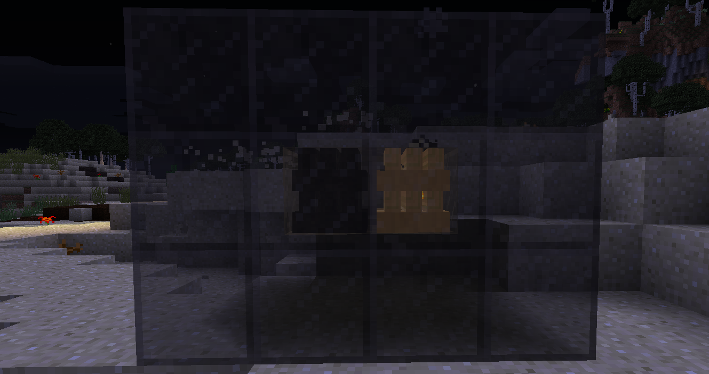

冶炼炉里所需的木炭与原版木炭不同，这里的木炭需要通过原木堆在完全封闭的情况下点燃后生成获得。
（注：这里的完全封闭所需方块为：地狱砖、红色地狱砖、末地石砖、砂岩、铁块、金块、干泥块、铁化玻璃等
原木堆露天燃烧或周围的方块不正确会变成灰烬，而铁树原木堆和紫杉原木堆则分别变成铁木灰和紫杉木灰。

左侧为木炭堆，右侧为点燃后的原木堆，原木堆被点燃后会有粒子效果，在这里为了方便演示，使用的方块为铁化玻璃，也可以将它更换成上述的方块。
木炭堆所产出的木炭优良由木炭堆的质量决定，木炭堆的质量取决于制作原木堆的材料。以下为质量表格
劣等木炭堆：白桦树原木堆、紫杉原木堆
中等木炭堆：橡树原木堆、深色橡树原木堆  
良等木炭堆：云杉树原木堆、金合欢树原木堆 
高等木炭堆：贝叶棕木堆、铁树原木堆、云杉树原木堆
注：纯净碳块仅在高等木炭堆内出现