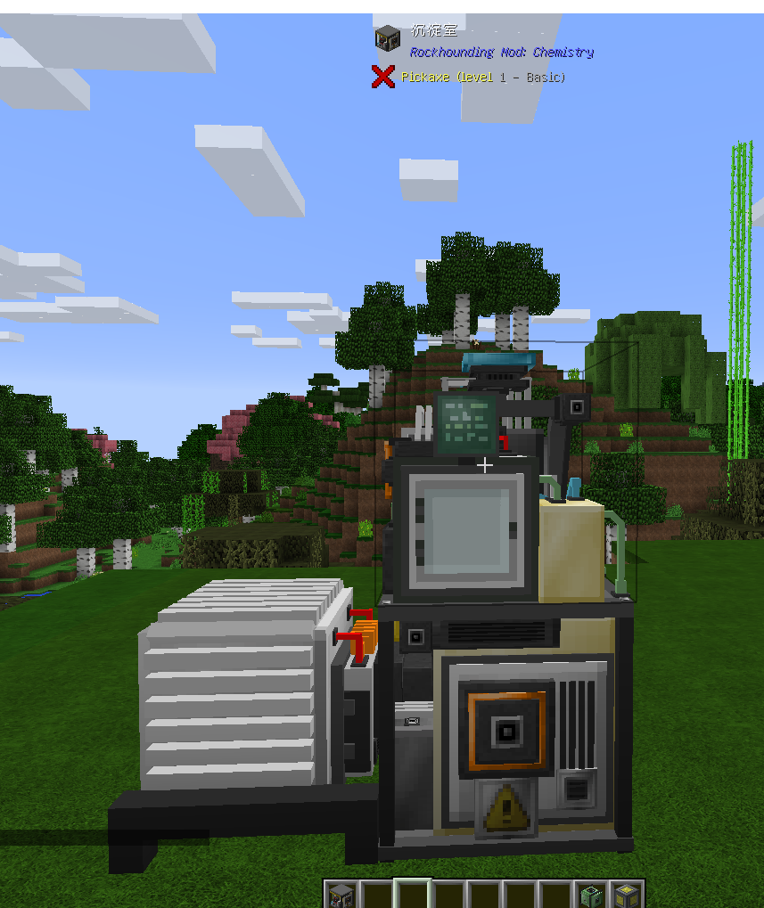
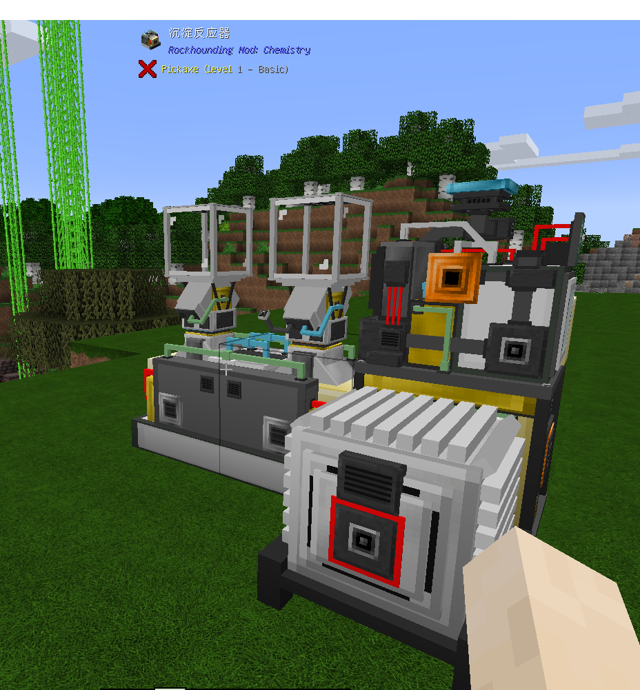
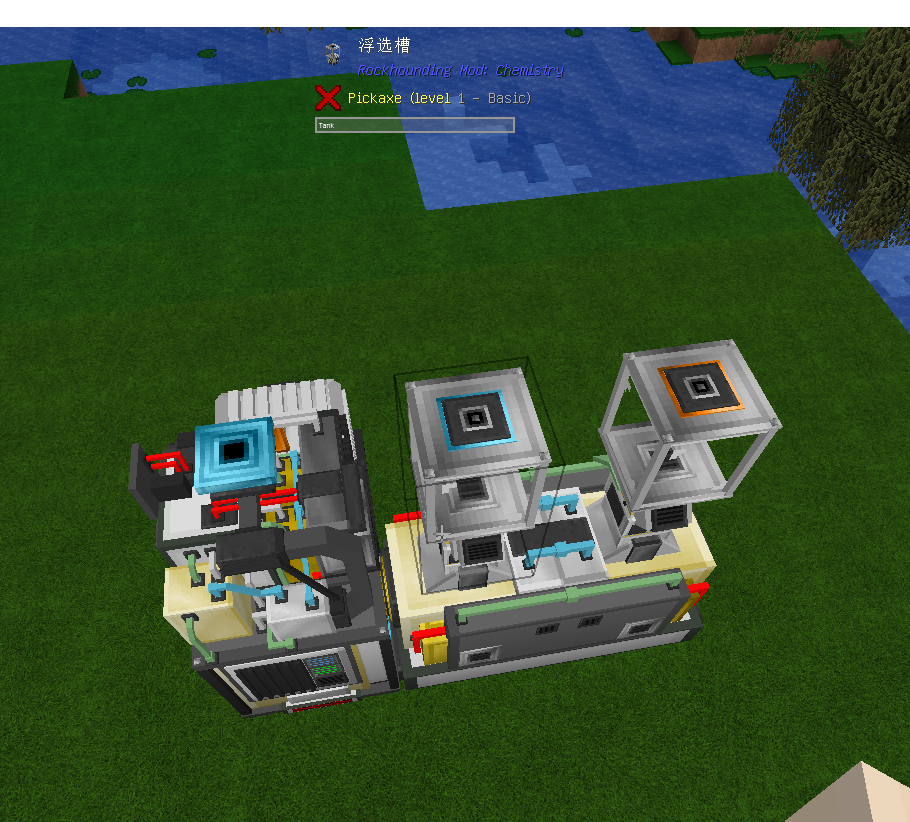

 沉淀室可以使用一些化学材料和流体生产其他化学材料(化合物)。
需求：沉淀室，沉淀反应器 x2，浮选槽，缓冲罐，电站+燃气轮机升级，服务器（可不选）
摆放如下:
正面

侧面

顶部

右键上层时可以打开GUI输入材料，右键下层输出产品。
    流体材料的输入浮选槽，而沉淀室工作的副产品：有毒废液输出到缓冲罐。
    在设备GUI中，你需要调整设备的配方，然后点击"激活"按钮，然后才能在GUI中放入原材料。你可以放入的原材料有材料和催化剂两种，催化剂需要选择特定的合成表才能放入，具体在JEI中查看。