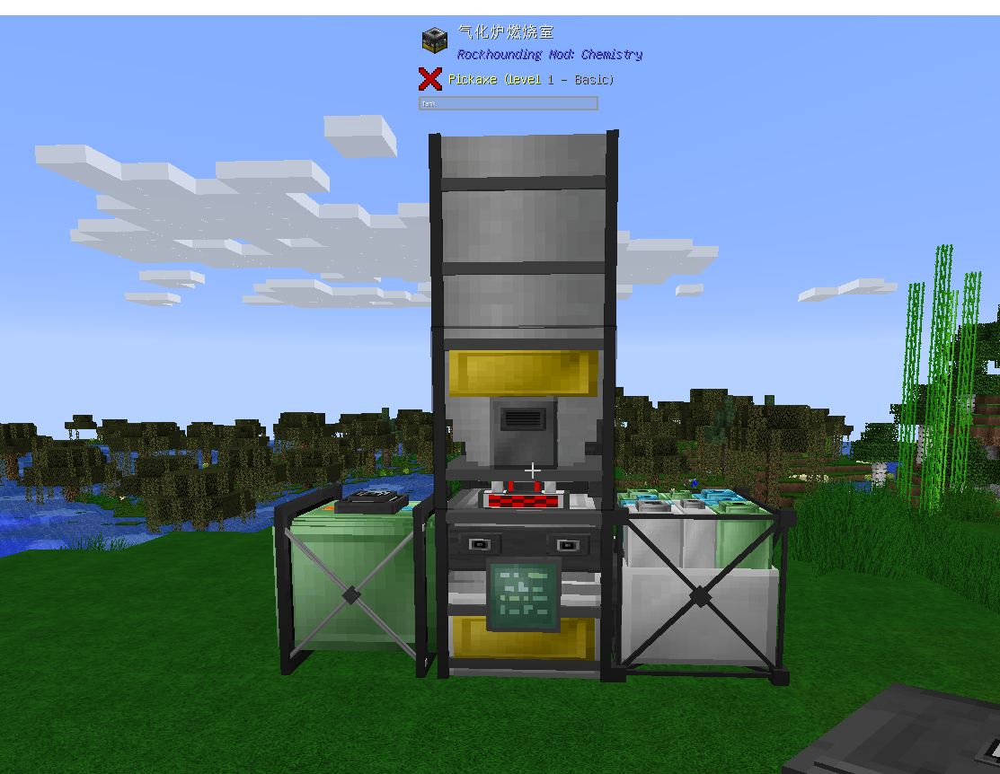
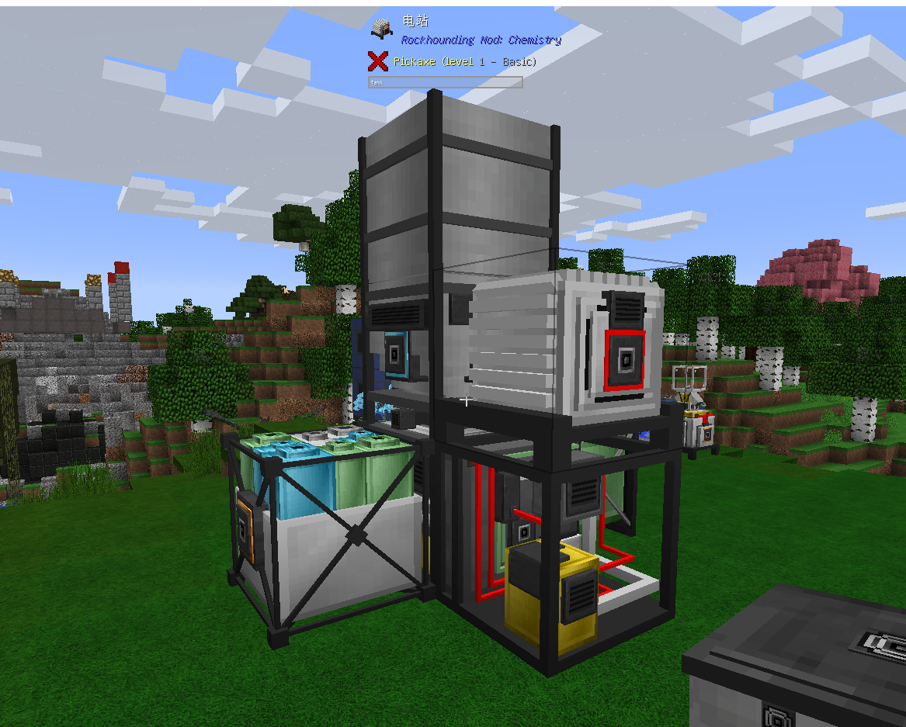
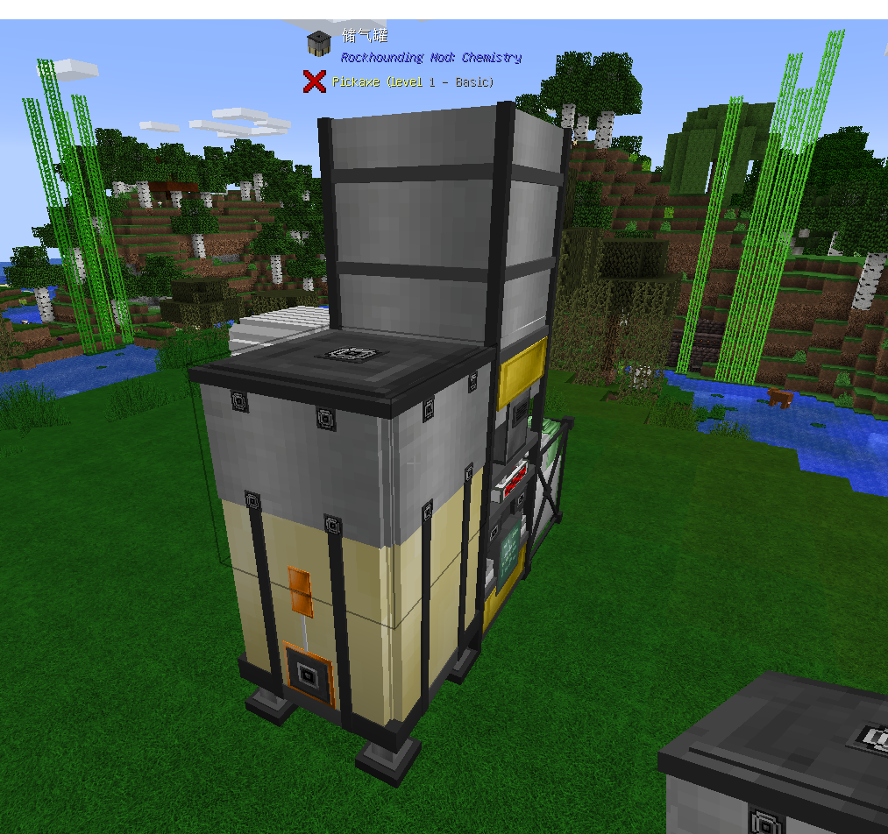
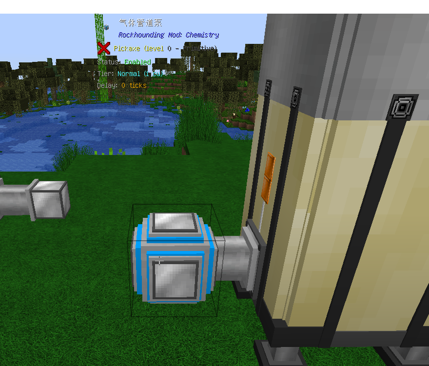

 气化炉的主要用途是使用煤浆或有机浆料生产生合成气，水蒸气和处理有毒废液
需要：气化炉燃烧室，气化炉水箱，集尘器，气体增压器，电站，储气罐/压力容器
搭建方式如下：
摆放正面

背面

用储气罐

不同的配方拥有不同的温度需求，例如水蒸气就是400K (基础温度300K) 。当你给气化炉提供能源和工作原材料后，温度就会以300tick/K的速度上升 (也就是15秒/K)，当温度达到配方所需温度时就会开始工作，你可以在气化炉燃烧室里安装一个耐火升级让温度上升速度提高到100tick/K (5秒/K)。
    气化炉燃烧室的下层可以打开GUI，在GUI中你可以查看工作状态 (例如炉温) ，还可以安装耐火升级和速度升级。上层则是一个液体容器，气化炉燃烧室的上层与燃烧室水箱共同组成气化装置的两个液体输入区，而不是使用常见的液体输入系统

注：本模组的气体导出需求本模组的气体管道泵和气体管道,气体管道泵默认是关闭状态，需shift+右键调节。如图所示：
泵关闭状态

泵开启状态
