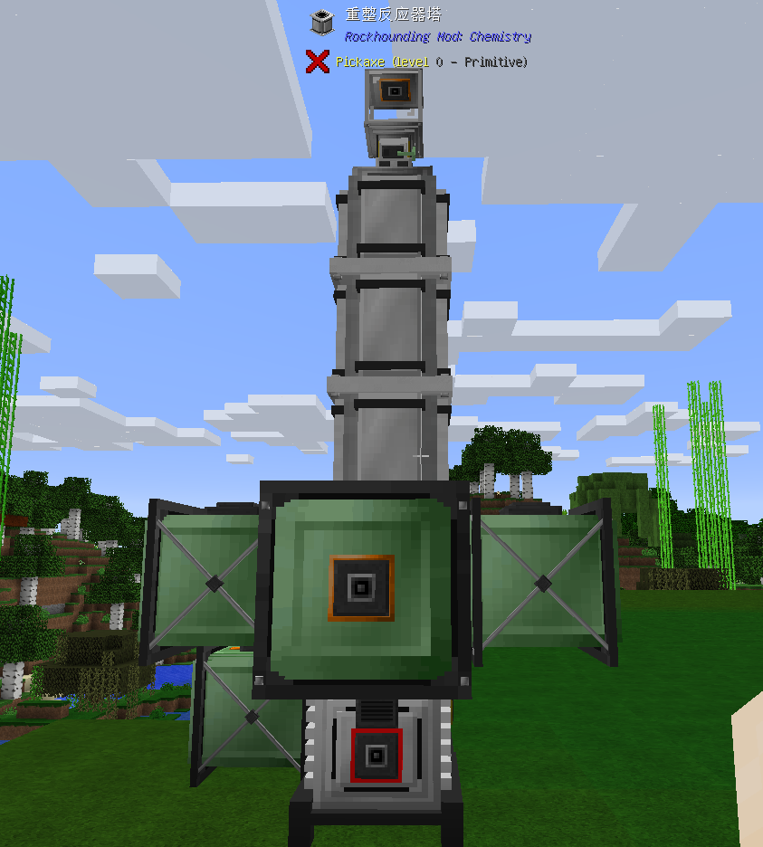
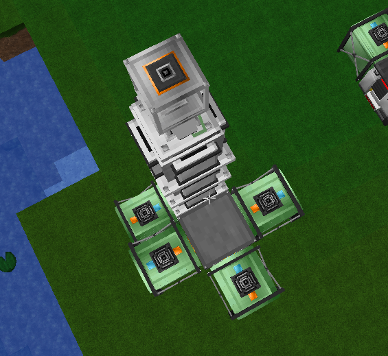
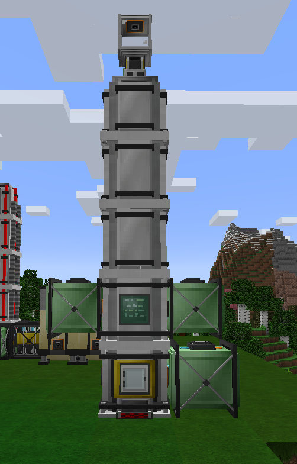

重整反应器可以生产氨，硝酸，甲醇，氢气，丙烯酸，合成气。需求：重整控制器，重整反应器塔x2，重整反应器塔顶，分离器，储气罐/压力容器x3，电站+燃气轮机升级，缓冲罐，储气罐/压力容器x1(可选)，服务器(可选)。
摆放如下：
背面

顶部

正面

重整控制器内选择你要制造的产品，两个输入口的储气罐/压力容器就会自动过滤只允许输入目前工作所需的原材料。你还要在重整控制器上层内安装触媒。触媒分为两类，一类是系催化剂(System Catalysts)，一类是反应催化剂(Reaction Catalysts)。系催化剂需要6个，反应催化剂需要4个，你需要将他们分别填入GUI中蓝色和绿色的空格。

    系催化剂有石墨触媒，白金触媒，镍铝触媒三种，而反应催化剂有金触媒，锇触媒，铂触媒，沸石触媒，钴触媒，镍触媒，钼触媒。重整反引起生产任何产品所需要的系统催化剂可以是三种中的任何一种，而反应催化剂则会按照产品的不同需要除了金触媒以外的任意一种，金触媒则可以代替任何一种其他触媒使用，是一种通用方案。