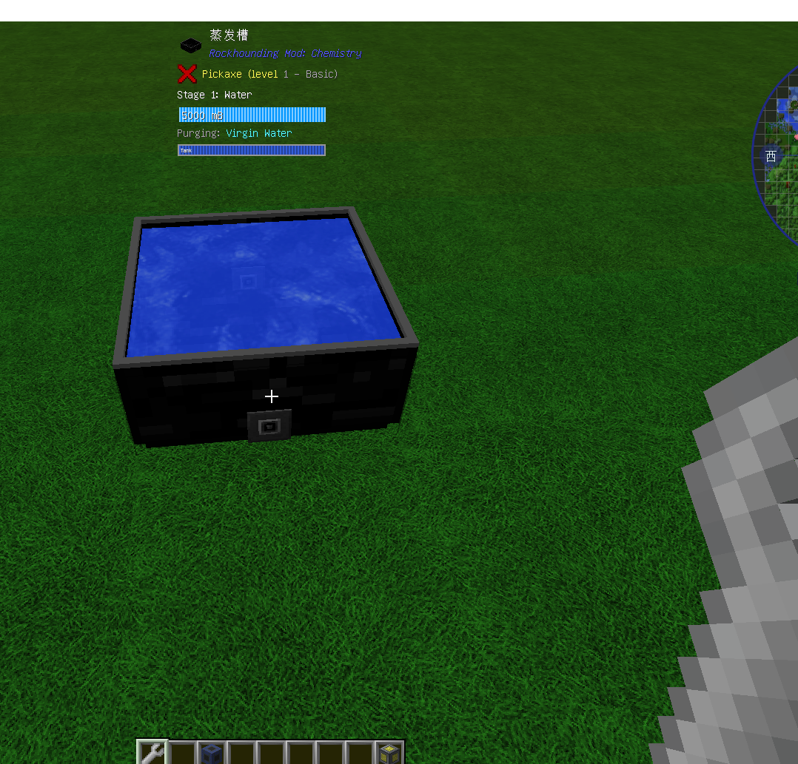

发槽用于蒸发水以产生盐或者其他盐水，在装满水(5000mB)后，确保蒸发槽能照射到阳光，水就会逐渐蒸发。
如果玩家需要的产品不是原盐块，而是某种盐水时，玩家需使用模组扳手右击蒸发槽可以调整预期产品，只有当蒸发槽内的流体已转化成预期产品时，蒸发槽内的流体才能被抽取。

蒸发槽内的流体正处于Stage 1(第一阶端)，内容(Content)是水，而预期产品是：Precipitation。
在这种情况下，当蒸发槽内的水蒸发到第四阶端 Precipitation 时，蒸发槽内的流体才能被管道抽取。
    水的蒸发一共有 7 个阶端：
第一阶段：水 (Water)
第二阶段：原生水 (Virgin Water)，5000mB的水会转化成5000mB的原生水。
第三阶段：低密度盐水/饱和盐水 (Brine)，5000mB的原生水会转化成4000mB的饱和盐水。
第四阶端：低密度盐水/饱和盐水(Precipitation)，4000mB的饱和盐水会转化成3000mB的饱和盐水。
第五阶端：浓盐水(Evaporation)，3000mB的饱和盐水会转化为2000mB的浓盐水。
第六阶端：母液(Mother Liquor)，2000mB的浓盐水会转化成1000mB的母液。
第七阶端：原盐块，1000mB的母液会转化成一个原盐块。除了管道和漏斗，使用铲子右键也可以将其取出。
在shift下可以看到具体状态