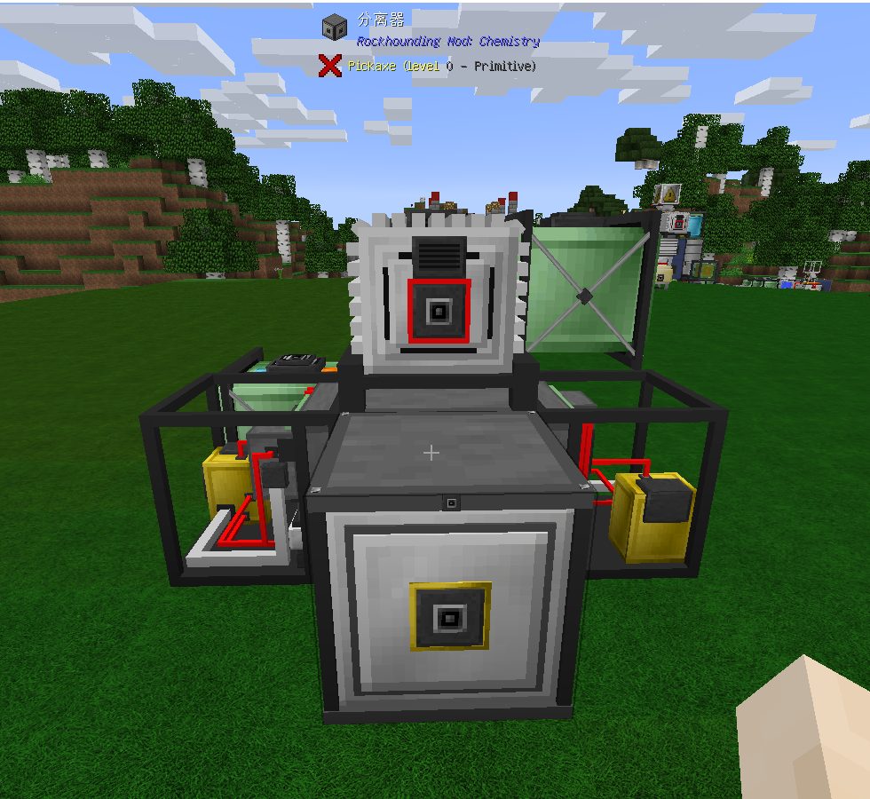
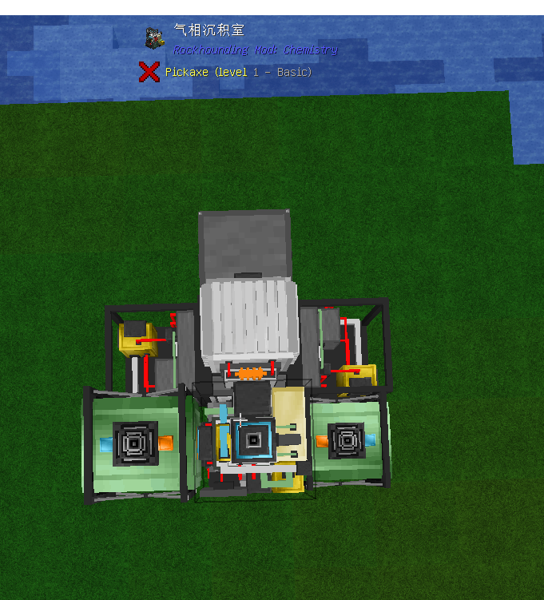

相沉积室用于制作例如氮化硅锭，碳化硅锭，氮化钛锭，碳化钨化合物。具体配方以jei为准。需求：气相沉积室，压力容器(储气罐) x 2，分离器 x 2，气体增压器 x 2，电站(需要燃气轮机升级)，服务器(可选)。
摆放如下：
背面

顶部

正面

气相沉积室工作时会先消耗能量给设备内部加压，安装外壳升级可以使加压速度提高到原本的十倍。
如果安装绝缘升级会大幅降低设备在待机时压强的降低速度。
