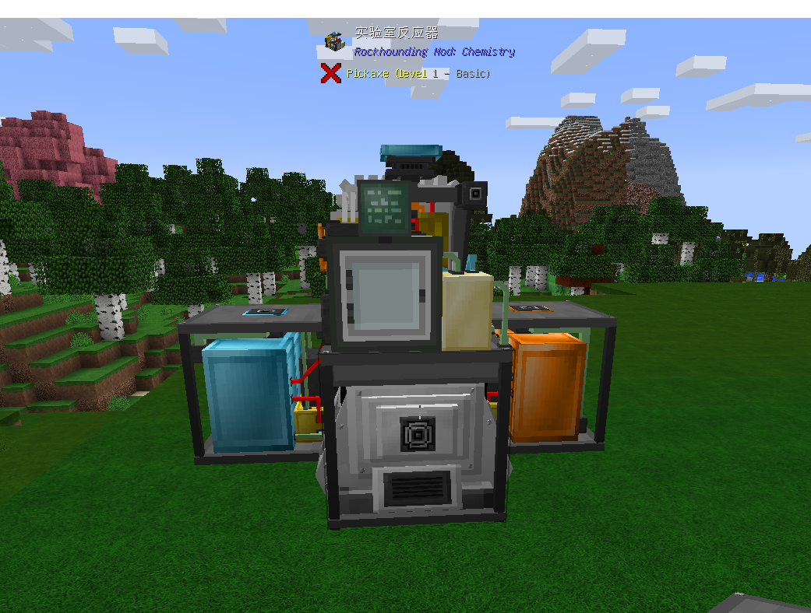

实验室反应器用于使用流体和化合物合成其他流体产品, 需：实验室反应器，分离器，电站，液体输入系统，液体输出系统，服务器(可选)，摆放方式如下：
正面

背面

实验炉有时会有多达四种材料的投入。他们分别是：两种原材料液体，一种原材料化合物，一个触媒。其中两种液体通过液体输入系统输入，而化合物和触媒则需要放入实验室反应器的GUI。如图所示：

你需要在GUI中选择当前生产的产品，当你选择了一种产品后，实验室反应器和液体输入系统将只能接受当前产品所需的材料和触媒。需要注意的是，例如产品"硫酸"和产品"Sulfuric Acid Plus"其实都是生产硫酸，但区别是，Sulfuric Acid Plus的生产过程中需要使用触媒，并且提高产量。还有其他一些"Plus"配方也是如此，所以如果你要使用触媒的话一定要选对配方，否则你的触媒放不进去。