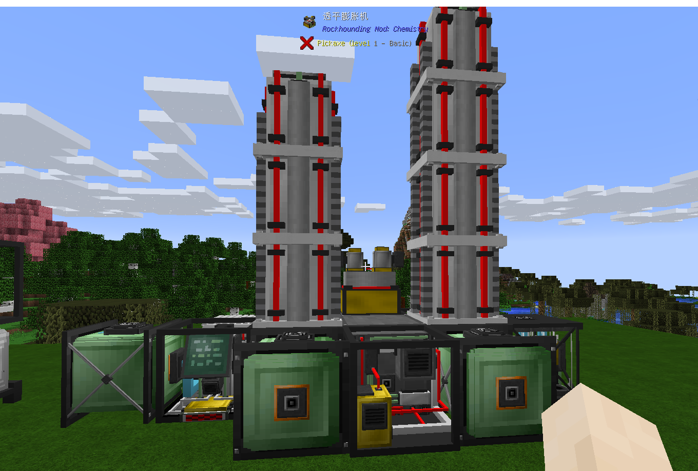

低温蒸馏塔用于将冷却空气加工成氧气，氮气，以及其他稀有气体，需求：：GAN控制器，GAN注入器x2，GAN塔x5，GAN塔顶x2，透平膨胀机，分离器，气体增压器x3，稀有气体瓶，压力容器/储气罐x3（储气罐x6可选可不选，主要是存储稀有气体），电站+燃气轮机升级。摆放如下：
背面

顶部

正面

稀有气体存储（可选可不选）

 在GAN控制器中，你可以选择生产氮气或氧气或稀有气体。这三个生产流程可以同时打开也可以只打开一两个，打开的流程数量会影响到消耗的能源，但不会节约或增加冷却空气的消耗。

    而在稀有气体瓶中，你也可以选择只收集哪几种稀有气体，但这不会影响到消耗的能源和冷却空气。而越靠后的稀有气体在每次工作周期中产出的数量和几率也会越低，这也不会被你选择的稀有气体收集种类影响到。