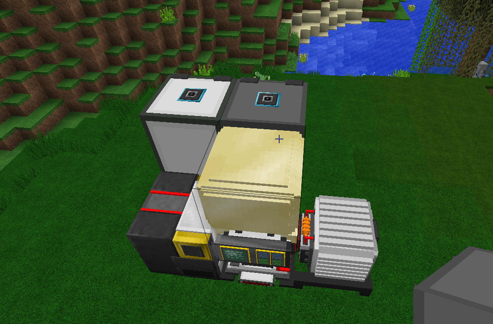
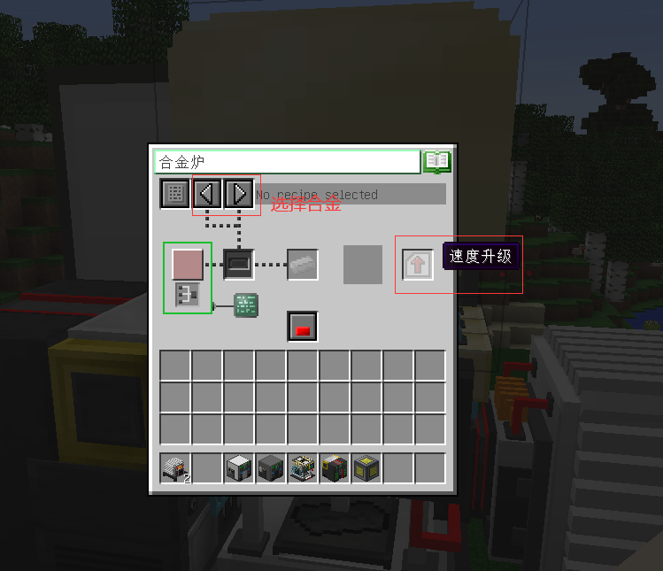
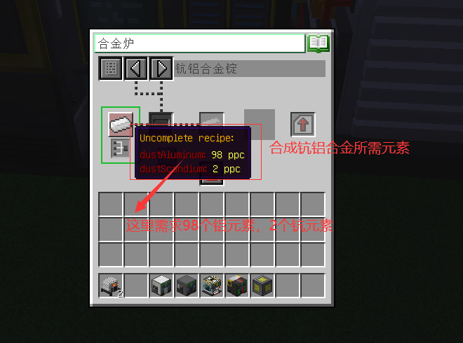
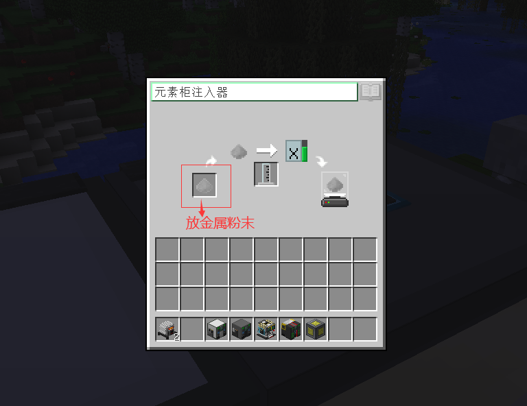

合金炉主要合成本mod的一些合金锭，需求合金炉1个，物料柜1个，元素柜1个,电站1个，模具锭一个（放在合金炉里），量斗2个（放置元素柜和档案柜），服务器1个（可不选），摆放方法如下：

打开合金炉GUI：

这里以钪铝合金为例，如图：合成钪铝合金需求98个铝元素，2个钪元素。

打开元素柜（主要打开上半部分，下半部分是显示元素界面），如图：元素柜放置金属粉末，需要消耗试管耐久

成品：

（注：物品柜用于以ppc为单位，储存各种非金属元素的粉末和其他mod添加的类粉末物品，元素柜用于以ppc为单位储存各种金属元素的粉末，100ppc=1粉，最大储存6400ppc，也就是1组 ）
放置好之后就可以合成了。
