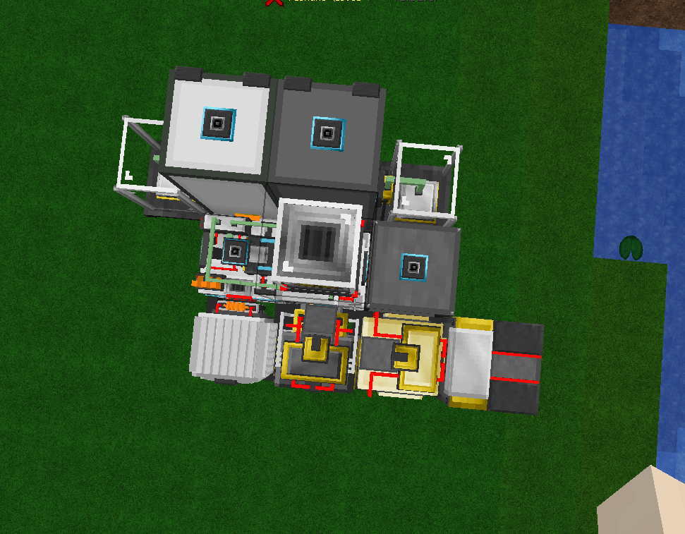
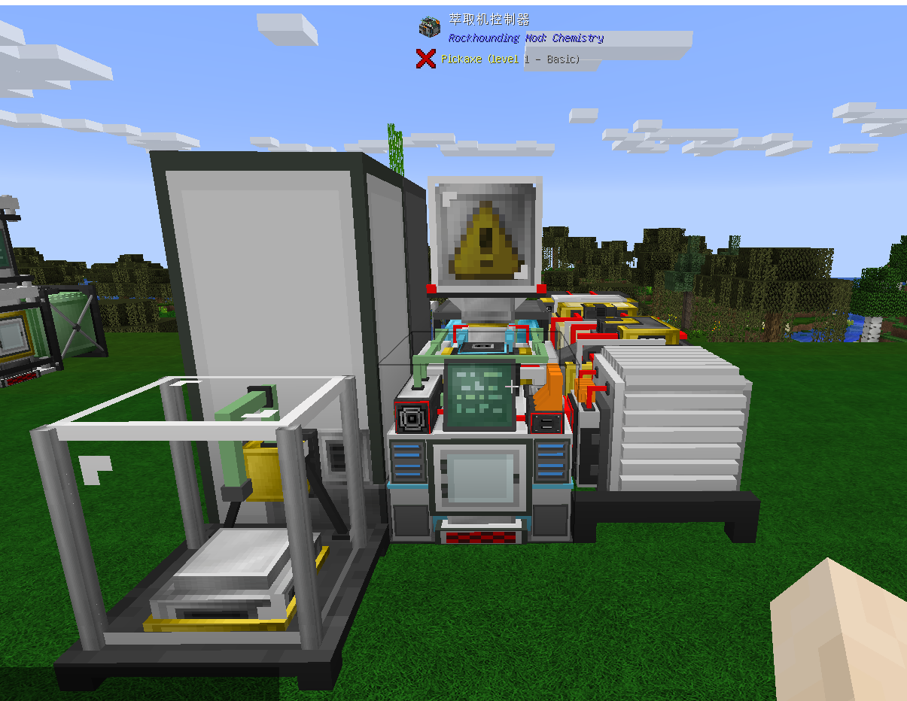

主要作用碎片中的化学元素提取并储存（或者取出提取出的化学元素）。需求：萃取机控制器，萃取机反应器，反应稳定器，物料柜，元素柜，实验室天平x2，玻璃器皿架，充电器，电站，液体输入系统，服务器（可不选）。准备物品：量筒x3，试管，铁触媒x6，燃气轮机升级。
摆放如下：
 顶部

正面

无化学萃取机工作消耗硝酸和氰化钠，消耗的量会根据你设置的 reaction intensity 变化，变化仅影响总量，二者比例总是 1:2 不变。另外 reaction intensity 也会影响RF消耗。reaction intensity 设置的越低，各项消耗也会越低。理论上来说一些矿物碎片需要较高的 reaction intensity 来获取其中占比较低的元素，然而在实际测试中最低的 reaction intensity 就足以获得每一种元素
    量筒，试管，铁触媒会逐渐损失耐久
  注：不安装实验室天平，不在元素/物料柜上层放入量筒并不影响化学提取机的工作，但你会无法输出产品。而且你并没有办法直接从实验室天平中取出已经从元素/物料柜中输出的各种粉，只能使用漏斗或管道等间接方式（实验室天平是下面输出）。