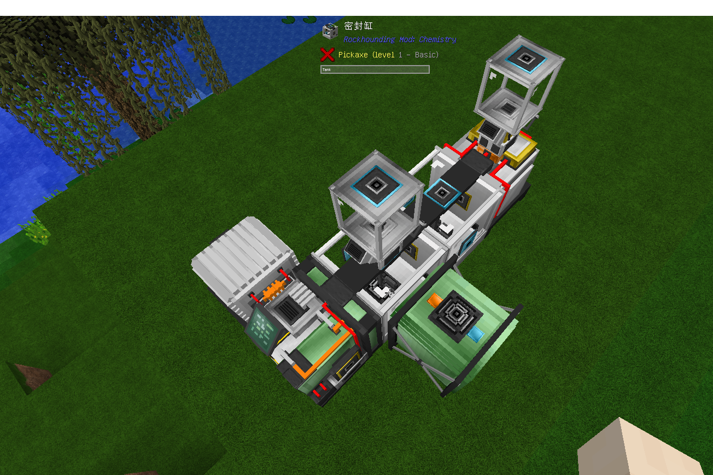

回收槽是地质探秘矿物处理线的延伸设备，它可以从浸出槽的副产物：渗滤液中提取出一些矿物碎片。需要：回收槽控制器，(密封缸+搅拌器) x2，浮选槽，缓冲罐，样本收集器，储气罐/压力容器，电站，服务器(可选)
摆放如下：

回收槽正常工作，需要储气罐/压力容器内通入水蒸气，密封缸内通入氢氟酸，靠着样本收集齐的密封缸内通入水，浮选槽内输入渗滤液。
在回收槽控制器的GUI中，可以安装过滤升级和速度升级，调整Gravity level。未安装任何沥滤升级的情况下，无论你将 Gravity level 设置成多少，最终都会产生 ±2.6 的高额误差。你可以看到 Filtered interval 后面显示的 from x.x to x.x，这是你当前的实际过滤范围，这会导致经常会有所需 Gravity level 太接近碎片会同时出现来污染产出列表。沥滤升级不仅可以降低误差，同时也会提高你调整 Gravity level 的精度。(每一个碎片都有自己对应的 Gravity level ，你可以在JEI中查看具体数值)
产出的矿物碎片会进入样本收集器，需要即时清空样本收集器，任何残留都会导致回收槽停止工作。
另外，如果使用服务器来控制浸出槽，那么沥滤升级将失去效果，服务器内设置的 Gravity level 将固定拥有 ±2.0 的误差并且调整精度会从 1.0 降至 2.0 。