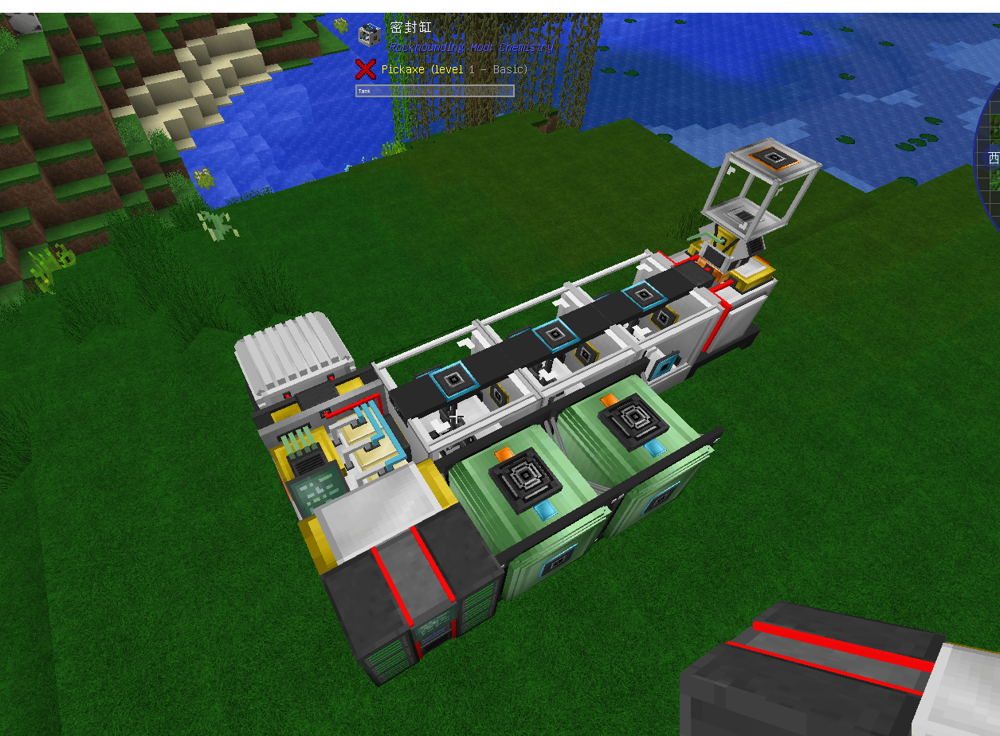
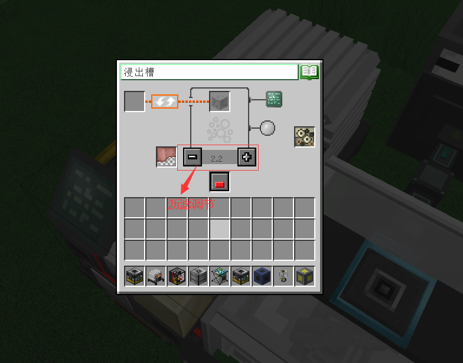

浸出槽主要处理矿物碎片，需要：浸出槽控制器，密封杠x3，搅拌器x3，储气罐/压力容器x2，样本收集器，缓冲罐，电站，服务器(可选)摆放方法如下：

注：放置浸出槽控制器和样本收集器需要保持朝向一致
使用：
  浸出槽控制器是尾矿的输入处，同时也可以安装沥滤升级和速度升级，最重要的是调整 Gravity level 。
    这个设置会决定你会从同一种尾矿中获得哪种碎片。但在未安装任何沥滤升级的情况下，无论你将 Gravity level 设置成多少，最终都会产生 ±2.6 的高额误差。你可以看到 Filtered interval 后面显示的 from x.x to x.x，这是你当前的实际过滤范围，这会导致经常会有所需 Gravity level 太接近碎片会同时出现来污染产出列表。的安装沥滤升级不仅可以降低误差，同时也会提高你调整 Gravity level 的精度。当你安装最高级别的沥滤升级时，调整精度会从 1.0 提高到 0.2 ，而过滤范围误差会降低到 ±0.1，在这时你就能精准的定位你想要的任何一种碎片了。如图所示：

    在三个密封缸中，你要从头到尾按顺序输入氢氧化钠溶液，盐酸，水(浸出槽控制器是头，样本收集器是尾)。同时密封缸内的搅拌器每次工作都会消耗耐久。然后在两个压力容器中通入水蒸气，这样浸出槽就可以开始干活了。
    产出的矿物碎片会进入样本收集器，但你需要使用自动化设备即时清空样本收集器，任何残留都会导致浸出槽停止工作。除了碎片，还会产生渗滤液被存在缓冲罐中。
    另外，如果使用服务器来控制浸出槽，那么沥滤升级将失去效果，服务器内设置的 Gravity level 将固定拥有 ±2.0 的误差并且调整精度会从 1.0 降至 2.0 。