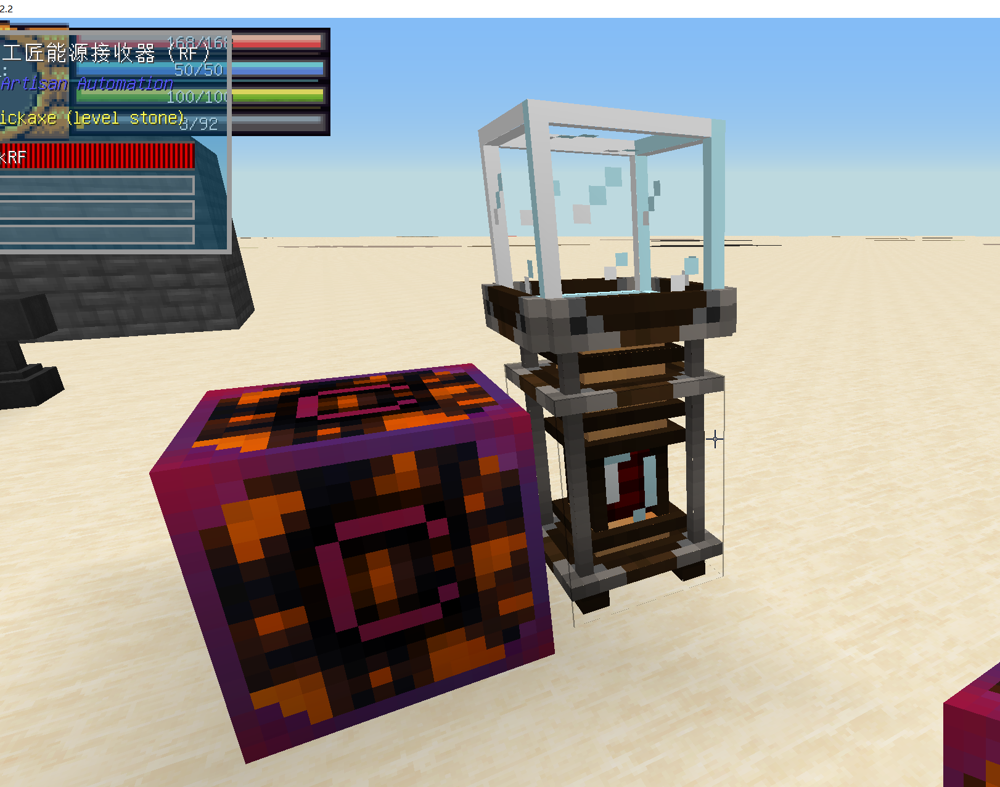

第一步，将工匠台放到接收器上方，并接上电源

第二步，将设计台和所需要设置的配方工作台联合在一起（如果配方为设计工作台制作就单独放置）然后打开需要的工作台，shift左键丢入图纸，并放上合成材料工具以标记

第三步，在第一个界面放置所需配方合成台（右边红条为电量条，蓝条为进度条），第二个界面放置配方蓝图，第三个界面放置材料，第四个界面放置流体，第五个界面放置工具（物品和流体需要用管道从能源台进入，工具不能）

是不是很简单.jpg