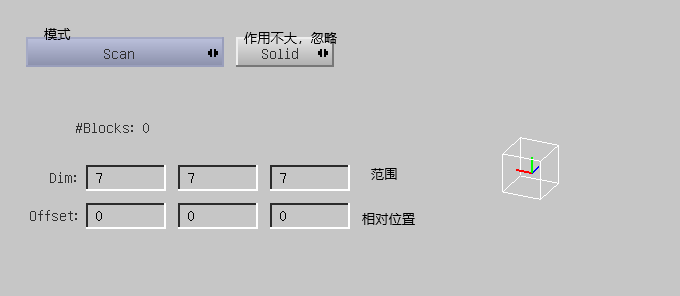
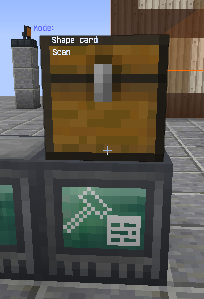

首先找到 Rftools 中的 建造机,扫描器,塑形卡片
以 抽屉管理器 为例

Step1:将结构摆放完整
Step2:手持塑形卡片，右键打开GUI
         右键点击 Box 将 Box 改为Scan，将范围调整至7*7*7

Step3:将塑形卡片放入扫描器左上角槽位，点击左侧按纽找到抽屉管理器结构，再点击左下角Scan扫描
         大写字母为移动16格，小写字母1格，wesndu对应东西南北下上6个方向

ps：可以边移动边点击scan寻找，找到后显示为一个灰色正方体
Step4:取出塑形卡片，打开，按照建造机摆放的位置和抽屉管理器结构的正中心的相对位置，修改offset
Step5:放入建造机，点击左侧中心的按钮预览建造位置

Step6:在建造机上方放置一个容器，放入材料，点击建造机GUI里的stop即可开始建造

本章指南，由热心群友 伪独¤陽光 和一个沉迷摸鱼的编写者提供