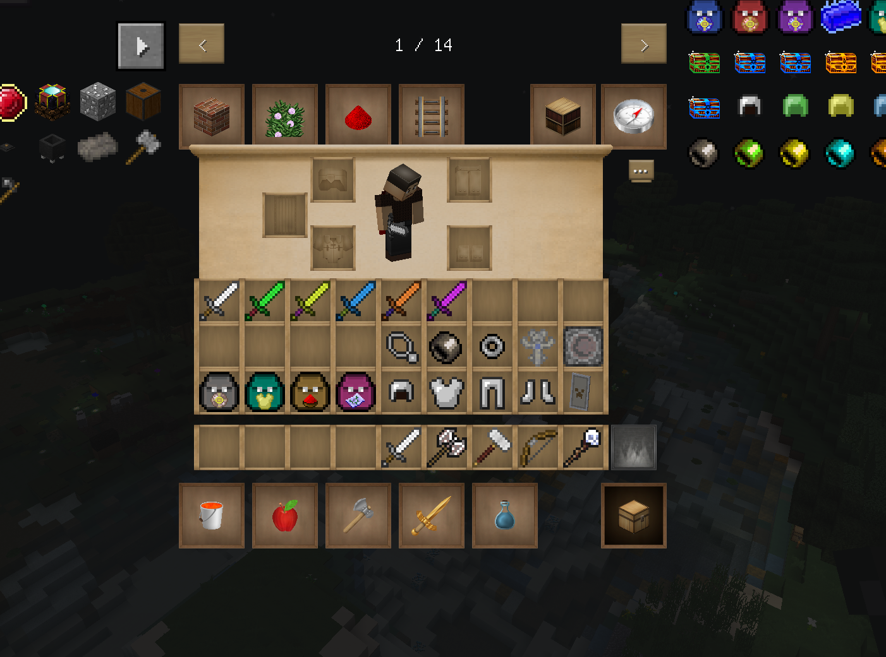
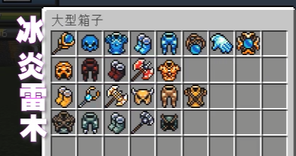

mod拥有较为复杂的装备系统，如图所示：
装备的品级共有六种（第一排），分别为普通，不寻常，稀有，史诗，传说，神话。不同的品阶属性有很大的差别。
饰品共有四种（第二排），分别为项链，护腕,指环,符咒。一共有五个饰品槽位，指环能装两个。第五个则是符文,用于在装备强化台中强化装备以激活符文之语(这会在另一篇讲到） 。
背包有四种（第三排）分别收集地图，装备，强化物以及战利品，另外有不同品阶的自动回收袋用于回收特定物品。
常态攻击有五种，没什么好说的，副手盾牌和装甲四件套，武器有五种，有不同功能：剑（消耗3体力，无攻击冷却），法杖（右键发射，只消耗体力不消耗法术，远程），锤子（范围aoe，体力消耗十点）,弓(消耗箭矢，远程，无体力消耗）斧（没用过，特点不明）

另外还有特殊装备，对应四种属性强化抗性等。